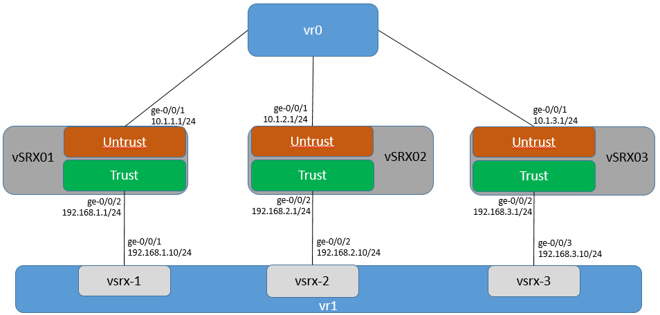

# Vagrant 5 Firefly
A Vagrant implementation that will spin up 5 Juniper Firefly perimeter (vSRX 1.0) VMs in a generic topology for testing various features. The inner and outer devices are in packet-mode and act as routers and the other 3 devices are in flow-mode and act as firewalls.

# Diagram

# Setup
1. Review the Vagrantfile
2. Host specific values can be customized using the YML files in host_vars. See in file comments.
3. vagrant up

# Login Information
root/Juniper   (default vagrant credentials)
lab/Juniper123 (credentials included in the templates)

